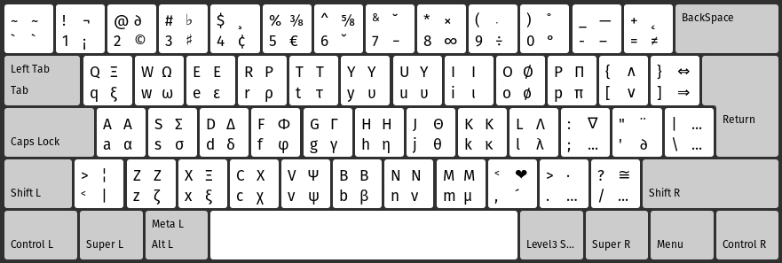

# Whitestone Keyboard Layout (wσ)


One day I stumbled upon [this blog post](https://morris-frank.dev/keymap/)
by Morris Frank. It made me realize how useful a computer keyboard can be if
some keys can be mapped to functions you need more often than those enforced
on you by standard mappings. Based on my personal preferences I developed
the **Whitestone (wσ) keyboard layout**, which is a **scientific programmer**
deviation from the **international Latin** keyboard layout. Currently (2021),
the layout is in a liquid state where it might change based on more empirical
observations. Please refer to the file `whitestone` for the most complete
information. You are free to make your own deviation.

## Key Features
- The 'standard' international (Latin) keyboard layout will still function when
it comes to 'pure' and `shift` strikes.
- All Greek lower and uppercase letters are reachable by using `alt` or
`alt + shift` on their Latin counterparts.
- Emoji's like 👍, 😉 and ❤ are directly reachable by the keyboard.
- Logical operators like ∨ ∧ ⇔ ⇒  ¬ are directly reachable by the keyboard.
- Mathematical symbols like ∂ ∇ ≠ ≅ ∞ ÷ · are directly reachable by the
keyboard.

## Installation
On most Linux systems (using
[X11](https://en.wikipedia.org/wiki/X_Window_System)), keyboard layouts are
stored in `/usr/share/X11/xkb/symbols`.
Install the keyboard layout stored in `<layout_file>` with correct privileges
(overwriting when needed):
```
> sudo install -Dm644 <layout_file> /usr/share/X11/xkb/symbols/<layout_file>
```

To activate the layout:
```
> setxkbmap <layout_file>
```
---

To permanently activate the layout may or may not be more of a hassle. The
easiest way is to check the keyboard settings in your desktop environment and
see if it is already available to add. If that is not the case it might help
to do one or more of the following:

- Add the following to `/usr/share/X11/xkb/rules/evdev.xml`, before
`</layoutList>`
```xml
<layout>
  <configItem>
    <name>whitestone</name>
    <shortDescription>wσ</shortDescription>
    <description>Whitestone Keyboard Layout (Scientific Latin)</description>
    <languageList><iso639Id>eng</iso639Id></languageList>
  </configItem>
  <variantList>
    <variant>
      <configItem>
        <name>whitestone</name>
        <description>whitestone</description>
      </configItem>
    </variant>
  </variantList>
</layout>
```
- Execute `> sudo dpkg-reconfigure xkb-data`
- Add `setxkbmap <layout_filename>` to `~/.profile` to activate the layout on
login: If GNOME is overwriting this setting execute
`> gsettings set org.gnome.settings-daemon.plugins.keyboard active false`.

## Limitations
- In Ubuntu 18.04 _scroll lock_ in Libreoffice modifies the
[behaviour](https://en.wikipedia.org/wiki/Scroll_Lock#Window_scrolling) of
arrow keys. Activating may
[introduce](https://askubuntu.com/questions/906723/fn-media-keys-slow-delayed-on-ubuntu-gnome-17-04)
problems of its own.
- It looks like it is not easily possible to include Unicode characters with a
[combining character](https://en.wikipedia.org/wiki/Combining_character) in the
xkb keyboard layout. Therefore, the red heart (❤) may end up being black,
depending on the program parsing the input.